# User Flow — Netchi Sentinel

```mermaid
flowchart TD
  %% ===== LANDING =====
  Home["🏠 Homepage<br/>/"]
  Hero["Hero Section<br/>Headline + CTA"]
  Tools["1://TOOLS<br/>Grid 5 Fitur"]
  Edu["2://EDUCATION<br/>Artikel Cards"]
  FAQ["3://FAQ<br/>Accordion"]
  Footer["Footer<br/>Nav + Sosmed + Credits"]

  Hero --> Tools
  Tools --> Edu
  Edu --> FAQ
  FAQ --> Footer

  %% ===== NAVBAR =====
  Nav["📌 Fixed Navbar<br/>(muncul setelah scroll hero)"]
  Nav --> Home
  Nav -.->|link| Br
  Nav -.->|link| PS
  Nav -.->|link| PG
  Nav -.->|link| UU
  Nav -.->|link| DD

  %% ===== FEATURE PAGES =====
  subgraph Tools Pages
    Br["🔍 Breach Checker<br/>/breach-checker"]
    PS["📊 Privacy Score<br/>/privacy-score"]
    PG["🔑 Password Generator<br/>/password"]
    UU["📜 UU PDP Hub<br/>/uu-pdp"]
    DD["👤 Dummy Data<br/>/dummy-data"]
  end

  Tools --> Br
  Tools --> PS
  Tools --> PG
  Tools --> UU
  Tools --> DD

  %% ===== BREACH CHECKER =====
  subgraph Breach Flow
    BrIn["Input Email / Data"]
    BrVal["Validasi Input<br/>(format email / sanitasi)"]
    BrCek["Cek Database<br/>(mock/simulasi)"]
    BrAman["✅ Hasil: Aman<br/>Tidak ditemukan kebocoran"]
    BrBocor["⚠️ Hasil: Bocor<br/>Detail kebocoran + saran"]
    BrErr["❌ Error<br/>Input invalid"]
    
    BrIn --> BrVal
    BrVal --> BrCek
    BrCek --> BrAman
    BrCek --> BrBocor
    BrVal --> BrErr
  end

  %% ===== PRIVACY SCORE =====
  subgraph Privacy Score Flow
    PSQuiz["Kuis / Checklist<br/>Kebiasaan Online"]
    PSHitung["Hitung Skor"]
    PSRendah["📉 Skor Rendah (0-40)<br/>Tips perbaikan"]
    PSSedang["📊 Skor Sedang (41-70)<br/>Saran peningkatan"]
    PSTinggi["📈 Skor Tinggi (71-100)<br/>Pertahankan"]
    
    PSQuiz --> PSHitung
    PSHitung --> PSRendah
    PSHitung --> PSSedang
    PSHitung --> PSTinggi
  end

  %% ===== PASSWORD GENERATOR =====
  subgraph Password Flow
    PGOpsi["Atur Opsi:<br/>Panjang, Karakter, Simbol"]
    PGGen["Generate"]
    PGResult["🔑 Hasil Password"]
    PGCopy["📋 Copy ke Clipboard"]
    
    PGOpsi --> PGGen
    PGGen --> PGResult
    PGResult --> PGCopy
  end

  %% ===== UU PDP =====
  subgraph UU PDP Flow
    UUList["Daftar Artikel / Pasal"]
    UUBaca["Baca Detail Artikel"]
    UUCari["Cari Artikel"]
    
    UUList --> UUBaca
    UUCari --> UUList
  end

  %% ===== DUMMY DATA =====
  subgraph Dummy Data Flow
    DDFields["Pilih Fields:<br/>Nama, Email, Alamat, No. HP, dll"]
    DDLokal["🇮🇩 Lokal Indo"]
    DDGen["Generate"]
    DDResult["👤 Hasil Data Palsu"]
    DDCopy["📋 Copy"]
    DDDownload["⬇️ Download (JSON/CSV)"]
    
    DDFields --> DDGen
    DDLokal --> DDGen
    DDGen --> DDResult
    DDResult --> DDCopy
    DDResult --> DDDownload
  end
```



---

## Alur Lengkap User

```
Landing (Homepage)
  ↓
Hero → Lihat Headline → Klik "MULAI SEKARANG" → Scroll ke TOOLS
  ↓
TOOLS → Pilih fitur → Masuk halaman fitur
  ↓
Gunakan fitur → Dapat hasil → Copy/Download
  ↓
Scroll ke EDUKASI → Baca artikel
  ↓
Scroll ke FAQ → Baca jawaban
  ↓
Navigasi via Fixed Navbar → ke halaman lain / balik ke Home
```

## Catatan

- **Tanpa login** — semua flow langsung bisa diakses
- **Mobile?** Homepage harus responsive (miring ke single column)
- **Bahasa**: ID/EN toggle di globe hero → mempengaruhi seluruh konten
